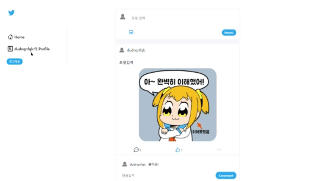

# Nwiiter

[구경하기](https://nwitterclone.netlify.app/)

## Reason

#### Why?

느위터는 이전 마이블로그 프로젝트에서 느꼈던 중앙 상태 관리의 필요성과 더불어  
리덕스와 리덕스 사가, 파이어베이스를 배워 익힌 지식을 응용하고자 시작된 트위터 클론 코딩입니다.

#### Info

느위터는 간단한 트윗 작성 및 게시 기능, 그리고 좋아요와 댓글 작성이 가능합니다.

 
 

## Stack

**느위터는 다음과 같은 스택으로 구성되었습니다.**

1. 편안한 사용자 경험을 제공 및 동적 UI를 위한 <strong>React</strong>

2. 빠른 서버 구축을 위한 서버리스 플랫폼 <strong>Firebase</strong> 

3. 중앙 상태 관리를 위한 <strong>Redux/Redux-Saga</strong>

4. css-in-js <strong>Style-Components</strong>

5. 자동 배포를 위한 <strong>Netlify</strong>

 
 

## Structure

#### 주요 폴더 구조는 다음과 같습니다.

-   components
    -   기본적으로 **페이지 별로 보여지는 컴포넌트**를 담당하는 폴더입니다.
    -   Layouts 폴더에선 **Sidebar와 Footer**를 관리합니다.
-   hook
    -   **커스텀 훅** 폴더입니다.
    -   **좋아요와 댓글 작성 등**의 커스텀 훅이 있습니다.
-   pages
    -   라우터에 따른 페이지 폴더이며, **주요 페이지 별 로직**은 이곳에 있습니다.
    -   Login은 login 페이지, Main은 메인홈, Profile은 유저 프로필 페이지입니다.
-   modules
    -   **리덕스 폴더**입니다. ducks패턴을 사용했습니다.
-   sagas

    -   **리덕스 사가 폴더**입니다. 리덕스 폴더 내에 있는 파일명 뒤에 saga를 붙여 구분하였습니다.

-   styles
    -   **공통된 스타일**을 담당합니다.
    -   **button, input, loader** 재사용 컴포넌트를 만들었습니다.

 
 

## Features

<ul>
<li><a href="#sign">회원가입/로그인</a></li>
<li><a href="#twit">트윗하기</a></li>
<li><a href="#like">좋아요/댓글</a></li>
<li><a href="#user">유저 글 불러오기</a></li>
</ul>

 
 

### <a style="color : black" id="sign">회원가입/로그인</a>

 

 

### <a style="color : black" id="twit">트윗하기</a>

로그인한 유저는 내용 및 이미지를 활용해 트윗할 수 있습니다.

 

 

### <a style="color : black" id="like">좋아요/댓글</a>

게시된 트윗엔 좋아요를 누르거나, 취소할 수 있고 댓글을 작성할 수 있습니다.

 

 

### <a style="color : black" id="user">유저 글 불러오기</a>

프로필 페이지에 들어가면 자신이 작성한 트윗이 불러와집니다.

 
    
